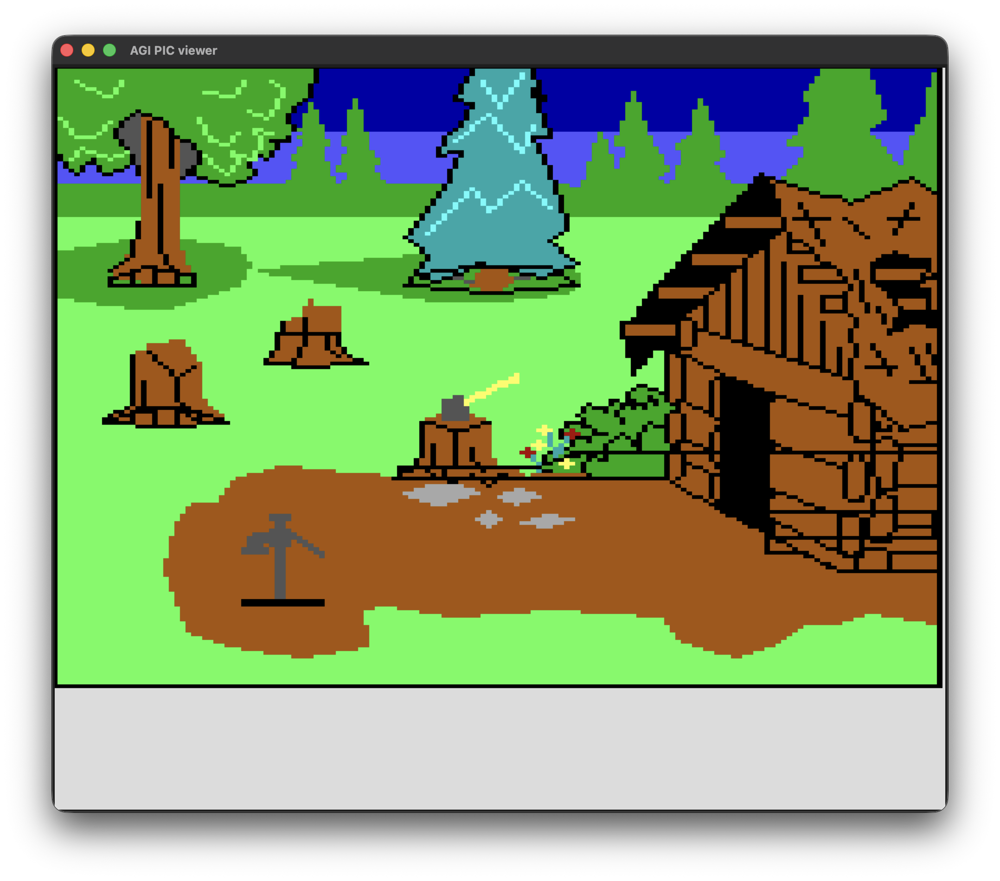

# Практические занятия №8-10

## Задания 
1. Некоторые операции с классами и объектами (вводное)
2. Любовь. Графики. Роботы, ой... Matplotlib (обязательное)
3. Задачи на работу с объектами (обязательное)
6. Визуализатор графики из старых компьютерных игр

### 📂 Таблица

| № | Файл | Описание |
|---|------|----------|
| 1 | [`task1.py`](task1.py) | Некоторые операции с классами и объектами |
| 2 | [`task2.py`](task2.py) | Любовь. Графики. Роботы, ой... Matplotlib |
| 3 | [`task3.py`](task3.py) | Задачи на работу с объектами |
| 4 | [`task6.py`](task6/task6.py) | Визуализатор графики из старых компьютерных игр |
